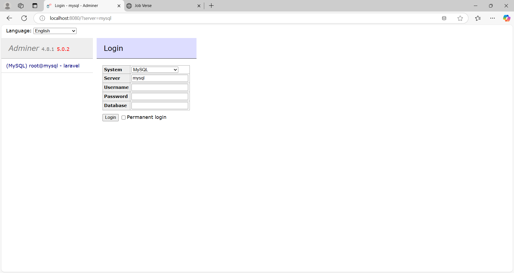
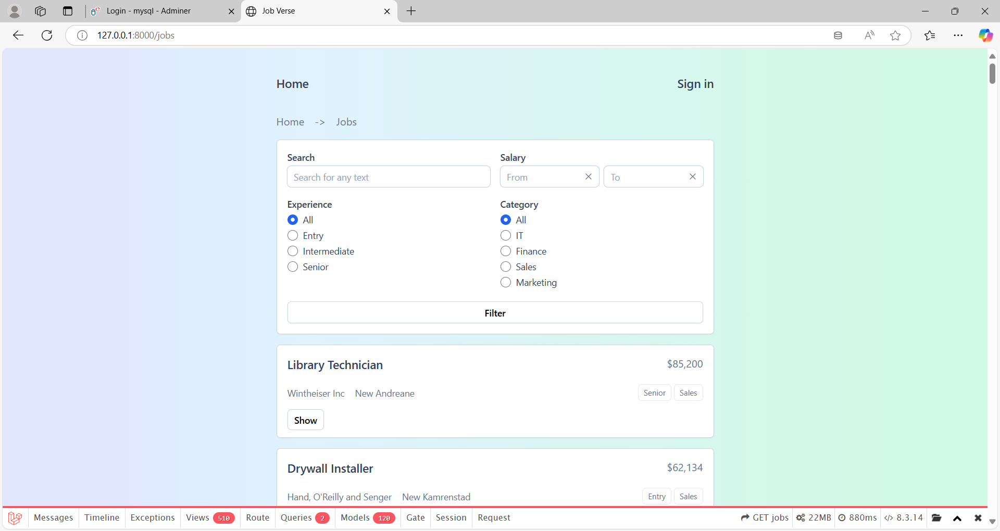

# JobVerse
This project is a web application built using Laravel and Tailwind CSS. 

Follow the steps below to set up and run the application on your local machine.

## Table of Contents
- [Prerequisites](#prerequisites)
- [Installation](#installation)
- [Docker Setup](#docker-setup)
- [Running the Application](#running-the-application)
- [Note: Add fake data for testing the Application](#note-add-fake-data-for-testing-the-application)
- [Note: For Adminer](#note-for-adminer)
- [Note: Final Output](#note-final-output)
- [Usage](#usage)
- [Contributing](#contributing)
- [License](#license)
- [Contact](#contact)


## Prerequisites
Before you begin, ensure you have the following installed on your system:

- PHP >= 8.0
- Composer
- Node.js & npm
- Docker & Docker Compose

## Installation
Clone the repository:
```bash
git clone https://github.com/AfshanAlamEngg/job-verse.git
cd job-verse
```

Install PHP dependencies:
```bash
composer install
```

Install Node.js dependencies:
```bash
npm install
```

Set up environment variables: Copy the .env.example file to .env and update the necessary environment variables.
```bash
cp .env.example .env
```

Generate application key:
```
php artisan key:generate
```

## Docker Setup

Start Docker services:
```
docker-compose up -d
```

Run database migrations:
```
php artisan migrate
```

Build your CSS: Run the following command to compile your CSS:
```
npm run dev
```

## Running the Application
Start the development server:
```
php artisan serve
```
Access the application: Open your browser and navigate to http://localhost:8000.

## Note: Add fake data for testing the Application
Add fake records to the application for testing:
```
php artisan db:seed
```

## Note: For Adminer
Write "mysql" for server in place of "db" like the below image:


## Note: Final Output
Final output will look like the below image:



## Usage
You can now start building your application using Laravel and Tailwind CSS. Use Tailwind’s utility classes to style your components and pages.

## Contributing
If you wish to contribute to this project, please fork the repository and create a pull request with your changes.

## License
This project is licensed under the MIT License.

## Contact
For any questions or suggestions, feel free to reach out:
- **Email:** afshanalamengg@gmail.com
- **GitHub:** [AfshanAlamEngg](https://github.com/AfshanAlamEngg)